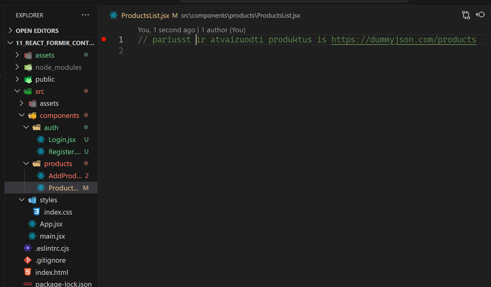

# Steps to tailwind

1. `npm install -D tailwindcss postcss autoprefixer`
2. `npx tailwindcss init -p`

# Praktika

1. Login 

2. Registerr 

3. List 

## Navigation

1. redirect

```js
const navigate = useNavigate();
navigate('/products');
```
