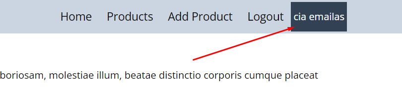

# practice

1. EMail 
2. perduoti email i headeri 
3. Email kaip ir token saugom ir trinam is localStorage

## add Posts

dokumentacija https://dummyjson.com/docs/posts

1. PostPage - atvaizduoja visus posts - publick
2. AddPostPage - forma sukurti postui - protected (matomaas tik prijijungusiems)
3. SinglePostPage - atvaizduoja 1 konkretu posta - public
